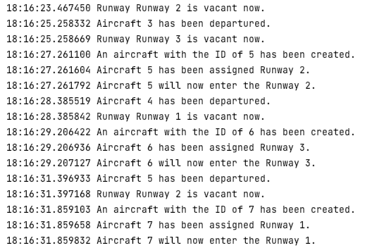

# Airport Departure Traffic Control
# Epam's course "Java. Threads" task

The purpose of the program is to simulate a departure process of the airport.
An airport may have multiple runways and multiple aircraft at any given time. 
The runways are fixed in place and are constantly accepting new tasks (aircraft) 
given that the runway is available for use.

According to the problem statement, there are exactly 5 runways that allow aircraft 
to depart. Therefore, no matter the number of aircraft, only 5 aircraft 
may actively do something at any given time. The aircraft took 3 seconds to departure.

Due to the reasons above, I have opted to create 5 runway threads. 
The aircraft are represented as objects which wait in a BlockingQueue 
until it is given an opportunity to execute.

When a runway is free, it will take an aircraft from the queue to execute
as a thread within the runway. The runway will pause and allow an aircraft
to execute in its thread. Once the aircraft is finished executing, 
the aircraft terminates and the runway will resume, attempting to take 
another aircraft from the queue. This process repeats until no more aircraft are left.

## Implementation

There are three java classes belonging to this program. 
The purpose and usage of each class is as follows:

### Aircraft

Aircraft is a runnable object. It has ID variable.

When instantiated, it accepts only parameter: an integer as its unique identifier. 

Once instantiated, it will announce that an aircraft with its ID has been created.

When run, aircraft will announce which runway it has been assigned to. 
Then, it will announce its enter to runway and sleep for 3 seconds to simulate it's departing. 
Having done so, it will then announce that is has completed its intention.

### Runway

Runway is a runnable object. It has a usage counter's, and a name.

When instantiated, it accepts two parameters: an integer as its unique identifier and 
a BlockingQueue to retrieve aircraft from.

When ran, runway will rename its thread to reflect the runway's name. 
It will then start a continuous loop to constantly attempt to accept an aircraft 
from the BlockingQueue until the runway thread is terminated. 
After accepting an aircraft, it will increment its usage counter by 1.
Once the aircraft has completed its tasks, control is returned to the runway.

### Airport

Airport is the main class of this program.
When executed, it will instantiate a random object to make certain decisions randomly. 
It will create a BlockingQueue to store aircraft.
Next, it will create a fixed thread pool set to the limit of 5 threads. 
This is because there will be exactly 5 runways running concurrently at any given time. 
5 runway objects are created and submitted to the thread pool to be executed.

Then, a for loop will create 10 aircraft. One aircraft is created every 0 to 5 seconds. 
Once created, the aircraft is added to the BlockingQueue where it will wait to be assigned a runway. 

Finally, once all generated aircraft have been assigned a runway and the queue is emptied,
the thread pool is shut down and the usage count of each runway is printed.

## Output

